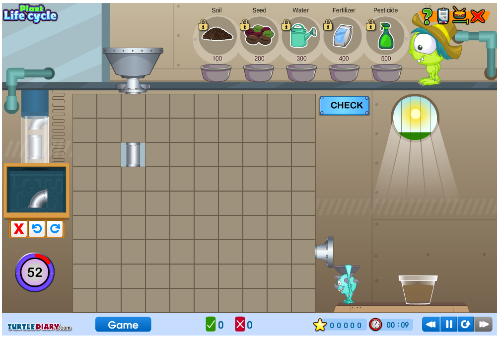

## Welcome to gameplanT 
#### Supported by the Carnegie Institution for Science

Here, we bring together resources for fun online learning games oriented toward plant biology and evolution. Each game synopsis includes a description of the game, where you can download for free or purchase the game, and additional info on how fun the game is (subjective pov) and cool features of the game. 

#### For those of us at Carnegie, follow the instructions **[here](README.md)** to gain access and edit this page.

For many of these games you will need Flash Player installed with the browser you use. You can find Flash player installation [here](get.adobe.com/flashplayer/)

### Plant Life Cycle
In the [Plant Life Cycle](https://www.turtlediary.com/game/grow-a-plant.html) game, you can grow your own virtual plant! Sponsored by [Turtle diaries], this game will teach you about the different parts of plants, how they contribute to plant function and life cycle!

**Download:** No download necessary, you can play this in your web browser! Go to -> [Plant Life Cycle](https://www.turtlediary.com/game/grow-a-plant.html)
**Free?:** yes!
**Game synopsis:** This game requires you to quickly build a system by which you can water and fertilize your plants. 
**BEST feature:** 

### Click below for game ideas from us at Carnegie

**[Im a plant!](Imaplant.md)**
